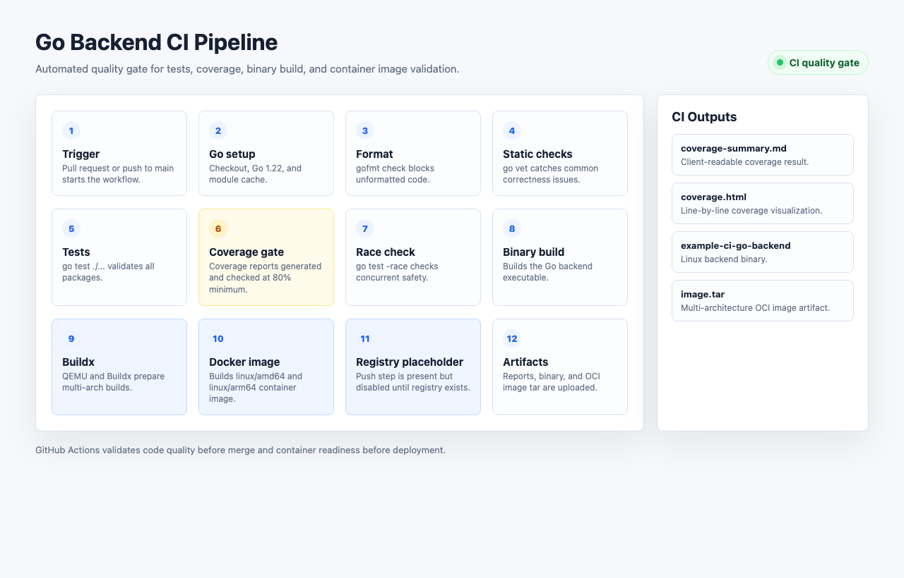
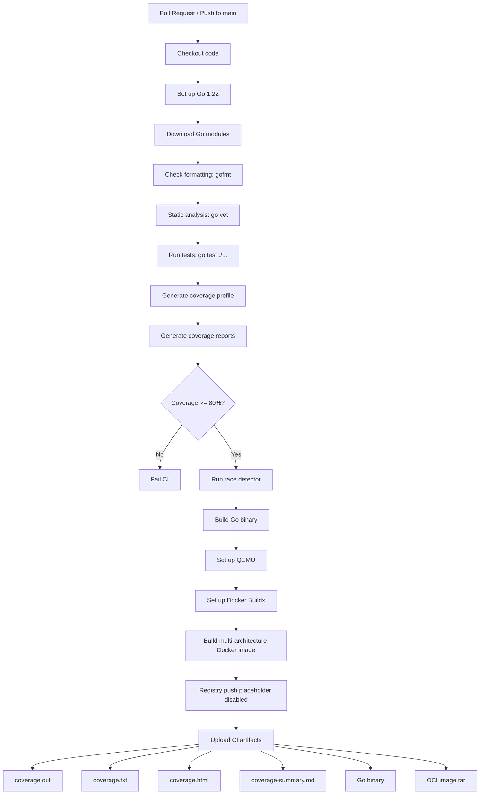

# Example CI Go Backend

This repository is a standalone Go backend project designed to showcase a complete CI pipeline for a freelance DevOps portfolio.

It can be used as a productized Upwork demo for this service:

> I will set up a complete GitHub Actions CI pipeline for your Go backend.

## Problem

Backend teams often have tests, formatting, coverage, race checks, and build validation split across local machines. That makes pull requests inconsistent and production releases riskier.

## Solution

This project demonstrates a practical CI quality gate for a Go service:

- Go formatting check
- `go vet` static analysis
- Unit tests
- Race detector test run
- Coverage profile generation
- Client-readable coverage reports
- Coverage threshold enforcement
- Binary build validation
- Multi-architecture Docker image build validation
- Registry push placeholder for future delivery workflows
- CI artifact upload

## Pipeline

Animated page:

[Open the interactive CI pipeline demo](docs/ci-pipeline.html)





## CI Outputs

| Artifact | Purpose |
| --- | --- |
| `coverage.out` | Raw Go coverage profile for tooling |
| `coverage.txt` | Function-level coverage summary |
| `coverage.html` | Visual line-by-line coverage report |
| `coverage-summary.md` | Client-readable coverage result |
| `example-ci-go-backend` | Linux backend binary |
| `example-ci-go-backend-image.tar` | Multi-architecture OCI image artifact |

## Stack

- Go
- GitHub Actions
- Standard library HTTP server
- Docker / Buildx
- No runtime third-party dependencies

## Run Locally

```bash
go test ./...
go test -race ./...
go run ./cmd/server
```

Open:

- `http://localhost:8080/healthz`
- `http://localhost:8080/readyz`
- `http://localhost:8080/orders/summary`

## Run CI Checks Locally

```bash
./scripts/ci-local.sh
```

## Docker

Build a local image:

```bash
docker build -t example-ci-go-backend:local .
```

Run it:

```bash
docker run --rm -p 8080:8080 example-ci-go-backend:local
```

The GitHub Actions workflow validates multi-architecture image builds for:

- `linux/amd64`
- `linux/arm64`

Because this demo does not use an image registry yet, CI exports the multi-architecture image as an OCI artifact:

```text
dist/example-ci-go-backend-image.tar
```

The workflow also includes a disabled registry push placeholder. When a registry is available, that step can be replaced with registry login and `push: true`.

## GitHub Actions

The workflow is defined in:

- `.github/workflows/ci.yml`

It runs on:

- pull requests
- pushes to `main`

## Client Value

This repository demonstrates that I can set up a maintainable CI workflow for a Go backend, including fast feedback, test coverage, build verification, and reviewable CI artifacts.

## Upwork Service Package

Use these files to present this repo as a sellable freelance offer:

- [Service package](docs/upwork-service-package.md)
- [Proposal template](docs/upwork-proposal-template.md)
- [Buyer requirements](docs/upwork-buyer-requirements.md)
- [Delivery checklist](docs/upwork-delivery-checklist.md)
- [Client handoff](docs/client-handoff.md)

Recommended Upwork title:

```text
I will set up GitHub Actions CI for your Go backend
```

Recommended first offer:

```text
Basic CI setup for a Go backend: gofmt, go vet, tests, coverage, race check, build validation, and documentation.
```
